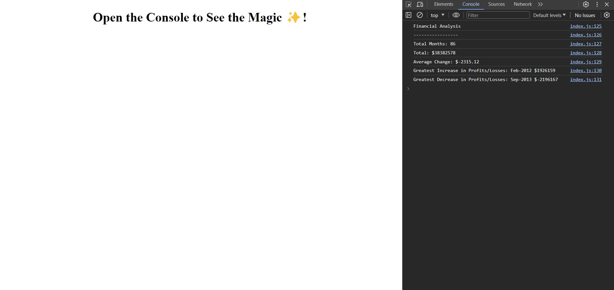

# Console Finances

Module 3 Challenge of the edX bootcamp

## Description
This website takes a JavaScript file with a hardcoded array of data and parses and extracts the financial information displays the extrapulated data in the console log.

## Screenshot

<a href="https://ph8tfunk.github.io/Console-Finances/"> Finances Website</a>

## Installation
N/A

## Usage
To use this website, you can review the output of parsed information via console.logs() by opening the Chrome DevTools of your browser. 

## Credits
Original source code provided by EdX.

## License
MIT license
